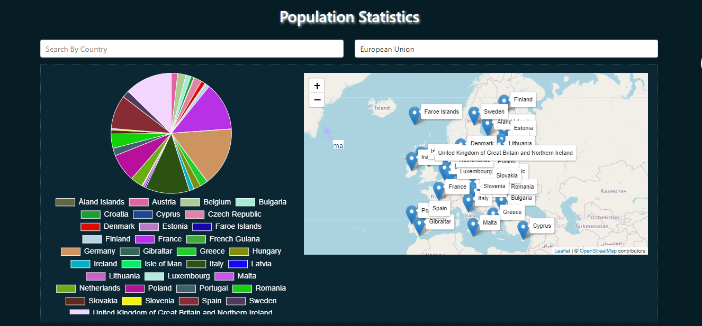

# Population Statistics

A simple project to show charts with map markers for the total population statistics for each country.

## Screenshot:

## Requirements:
- Yarn
- NodeJs
- Git

## Dependencies (libraries):
- ReactJs
- Typescript
- Redux
- LeafletJs
- react-chartjs-2

## Installation:
- clone the repository
- run `yarn`
- run `yarn start`

